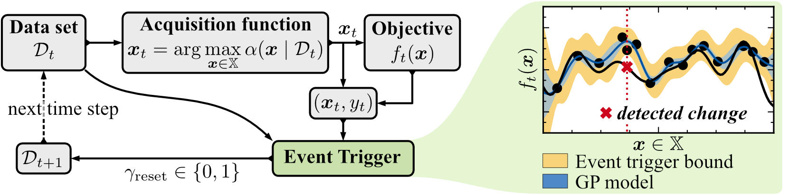

# Event-Triggered Time-Varying Bayesian Optimization

> _We are in the process of uploading the full code base. In the meantime, feel free to reach out if there are any questions!_



This repo contains the python implementations of ET-GP-UCB using GPyTorch [1] and BoTorch [2]. This `README.md` will guide you through the process of reproducing the results from the paper "Event-Triggered Time-Varying Bayesian Optimization" published at [Transactions of Machine Learning Research (TMLR)](https://jmlr.org/tmlr/index.html).

If you find our code or paper useful, please consider citing

```
@article{brunzema2025time,
  title={Event-Triggered Time-Varying {Bayesian} Optimization},
  author={Brunzema, Paul and Von Rohr, Alexander and Solowjow, Friedrich and Trimpe, Sebastian},
  journal={Transactions on Machine Learning Research (TMLR)},
  year={2024},
}
```


The structure of this folder is the following:

    .
    ├── objective_functions         # Objective functions
    ├── results                     # result files (empty)
    ├── src                         # Source files
    ├── utils                       # Utilities
    ├── examples                    # Example notebooks
        ├── run_{...}.ipynb         # jupyter-notebooks as run-scrips
        ├── explore_temperature_data.ipynb	# visual exploration and filtering of temperature data
    ├── ...
    ├── requirements.txt				    # .txt-file with package specifications
    ├── LICENCE         			      # MIT Licence
    └── README.md
    

## Installation
Create an environment called `et-bo` with Python 3.9.12, pull the content from this repo intro the environment, and install all needed packages with:

```bash
cd et-bo
source .venv/bin/activate
pip install -r requirements.txt
```

## Reproducing the experiments with synthetic data

To reproduce the experiments with synthetic data, we provide jupyter-notebooks.

- with a constant rate of change: `run_2D_synthetic_data.ipynb` 
- with a misspecified rate of change: `run_2D_misspecified_eps.ipynb`

Note that due to the upper bound on the upload size, the objective functions have to be recreated for each random seed. This is done automatically, but increases the runtime significantly. Therefore, for each of the experiment in the paper, expect a runtime up to 10h. (Of course you can also decrease the number of runs in the respective jupyter-notebooks.)

## Reproducing the application experiments

To reproduce the application experiments, some additional steps are necessary. 

### Real-world temperature data

The dataset with the temperature data was too large for the upload. Therefore, in the following, we will guide you though the steps of downloading and saving the dataset, to reproduce the results in Fig. 3 (b) and (c).

1. Go to the [Website of Intel Berkeley Research lab dataset](http://db.csail.mit.edu/labdata/labdata.html).
2. Download the temperature data (150 MB uncompressed). Then:
	3. Uncompress the data (if still compressed).
	4. Rename the file to `temperature_data.txt`.
3. Download the sensor placement data [here](http://db.csail.mit.edu/labdata/mote_locs.txt). Then:
	1. Copy the data and save it in a file called `coordinates_sensors.txt`.
4. Now save both files in `.../et-bo/objective_functions/applications/`.

To check if everything worked, open the jupyter-notebook `explore_temperatur_data.ipynb`. In this notebook, there is a visual exploration of the temperature data as well as the data preprocessing including subsampling the data in the required 10min intervals.

To reproduce the results in

- Fig. 3 (b) open the jupyter-notebook `run_application_temperature_data_days7and8.ipynb`
- Fig. 3 (c) open the jupyter-notebook `run_application_temperature_data_days5and6.ipynb`

### Policy search

You can reproduce the results of the policy search example in Fig. 3 (d) using the jupyter-notebook `run_application_policy_search.ipynb`. 

## References

[1] [Gardner, J., Pleiss, G., Weinberger, K. Q., Bindel, D., & Wilson, A. G. (2018). GPyTorch: Blackbox matrix-matrix Gaussian process inference with gpu acceleration. Advances in Neural Information Processing Systems, 31.](https://proceedings.neurips.cc/paper/2018/hash/27e8e17134dd7083b050476733207ea1-Abstract.html)

[2] [Balandat, M., Karrer, B., Jiang, D., Daulton, S., Letham, B., Wilson, A. G., & Bakshy, E. (2020). BoTorch: a framework for efficient Monte-Carlo Bayesian optimization. Advances in Neural Information Processing Systems, 33.](https://proceedings.neurips.cc/paper/2020/hash/f5b1b89d98b7286673128a5fb112cb9a-Abstract.html)